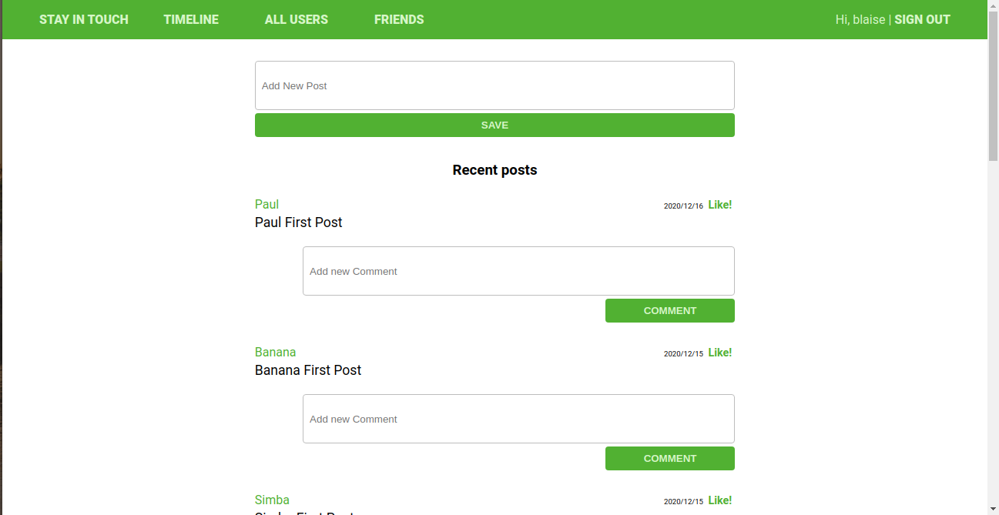
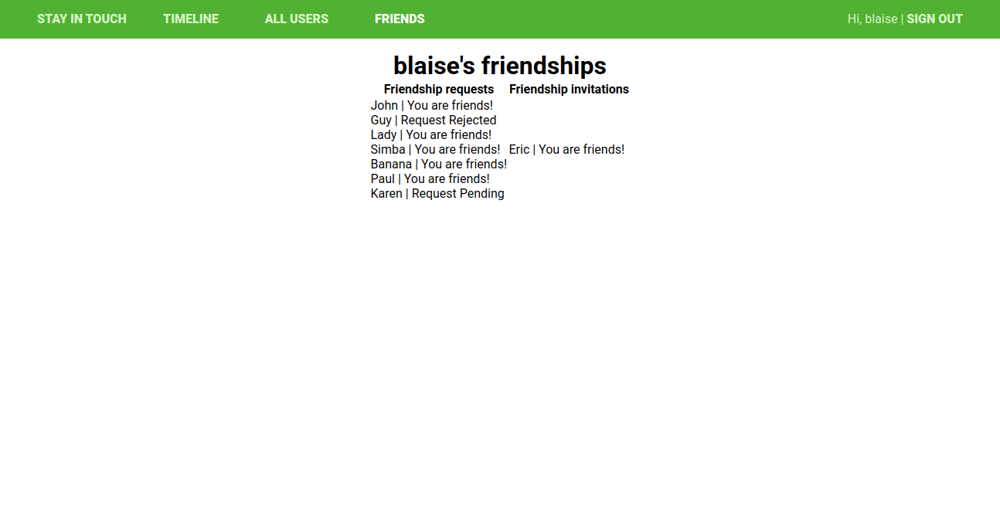
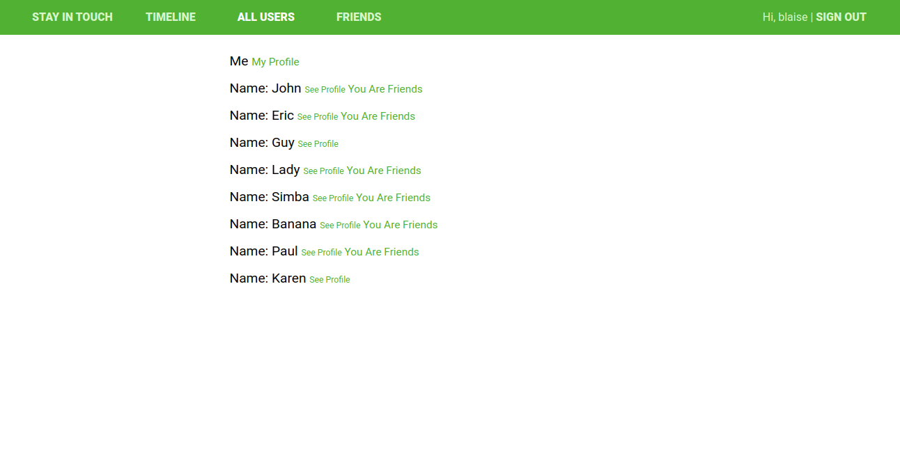

# Scaffold for social media app with Ruby on Rails

This project is a social media app. A user can create an account, follow other users, and start viewing their posts. A user can create a post, comment on other posts and even like them.





## Built With

- Ruby v2.7.0
- Ruby on Rails v5.2.4

## Live Demo

TBA

## Getting Started

To get a local copy up and running follow these simple example steps.

### Prerequisites

- Ruby: 2.6.3
- Rails: 5.2.3
- Postgres: >=9.5

### Setup

Clone this repository by running:

```
git clone https://github.com/Blaise-Shyaka/ror-social-scaffold/pulls
```

Instal gems with:

```
bundle install
```

Setup database with:

```
   rails db:create
   rails db:migrate
```

### Usage

Start server with:

```
    rails server
```

Open `http://localhost:3000/` in your browser.

### Run tests

```
    rpsec --format documentation
```

## Authors

👤 **Blaise Pascal SHYAKA**

- GitHub: [@Blaise-Shyaka](https://github.com/Blaise-Shyaka/)
- Twitter: [@blaise_shyaka95](https://twitter.com/blaise_shyaka95)
- LinkedIn: [Blaise Pascal SHYAKA](https://linkedin.com/in/blaise-pascal-shyaka)

## 🤝 Contributing

Contributions, issues and feature requests are welcome!

Feel free to check the [issues page](issues/).

## Show your support

Give a ⭐️ if you like this project!

